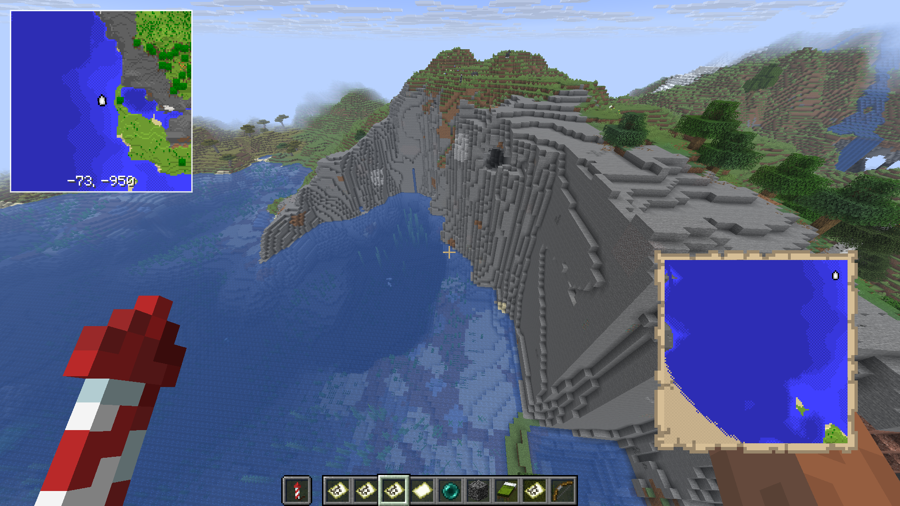
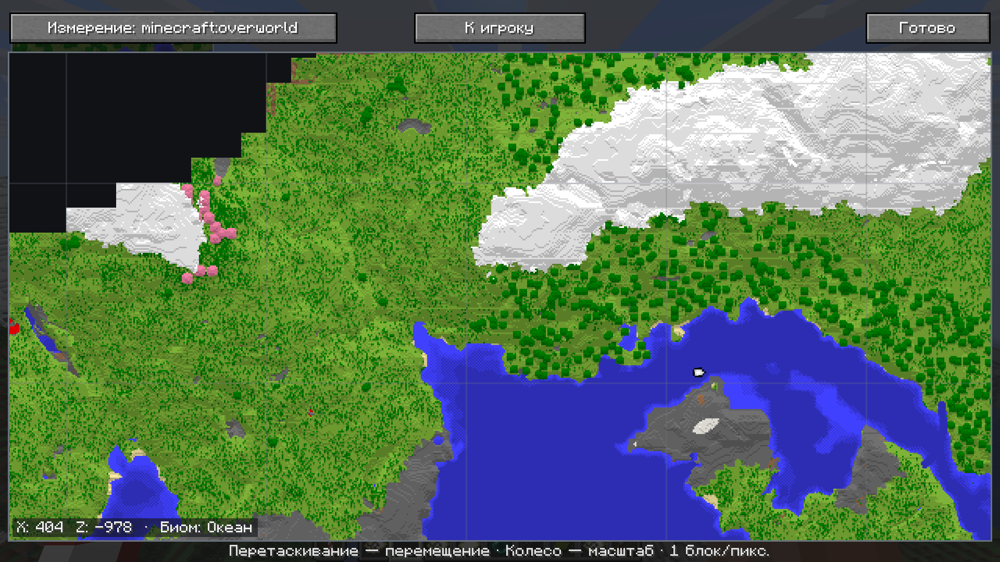

# Neverket Minimap

Клиентский мод для Minecraft Java Edition 26.2 и Fabric. Он умеет строить атлас либо из пикселей собранных ванильных карт, либо из всей местности, которую клиент действительно загрузил во время исследования. Никакие дополнительные чанки мод не запрашивает.

## Скриншоты

[Посмотреть все скриншоты](screenshots/)

### Мини-карта в игре



### Полноэкранная карта



## Что реализовано

- мини-карта в HUD с позицией и направлением игрока; по умолчанию она находится в левом верхнем углу и рисуется под стандартными элементами интерфейса;
- автоматическое объединение соседних ванильных карт;
- переключаемая запись по собранным картам или по всей исследованной игроком местности;
- детальный режим карт, уточняющий крупные пиксели по реально загруженным внутри карты чанкам;
- корректное наложение карт разных масштабов с приоритетом более подробных пикселей;
- отдельные слои Верхнего мира, Незера и Энда;
- отдельные атласы для каждого одиночного сохранения и адреса сервера;
- полноэкранная карта с сеткой 128×128 блоков, центрированием на игроке, координатами и опциональным биомом под курсором, перемещением мышью, масштабированием колесом и выбором измерения;
- настраиваемая пауза одиночной игры при открытой полноэкранной карте (на сервере игра продолжает работать);
- чёткая фильтрация без размытия и стабильная сетка выборки, уменьшающая рябь мелких деталей при движении;
- ванильное затенение рельефа и глубины воды в детально записанной местности;
- режим освещения карты: постоянная яркость или регулируемое затемнение ночью;
- опциональный туман войны с различимыми водой и сушей, плавной границей и дальностью до 32 чанков;
- настраиваемые угол, размер, форма, прозрачность, масштаб, координаты, стороны света и вид неизвестной территории;
- переназначаемые клавиши в стандартном меню Minecraft;
- автоматическое и атомарное сохранение данных;
- отсутствие mixin и любых сетевых запросов мода.

## Требования

- Minecraft Java Edition **26.2**;
- Java/JDK **25** для сборки;
- Fabric Loader **0.19.3 или новее**;
- Fabric API **0.154.2+26.2 или совместимая более новая версия для 26.2**.

Мод нужен только на клиенте. На сервер его устанавливать не требуется.

## Сборка

Проверьте Java:

```powershell
java -version
```

Версия должна быть 25. Затем в корне проекта:

```powershell
.\gradlew.bat build
```

Linux/macOS:

```bash
./gradlew build
```

Готовый файл появится в `build/libs/neverket-minimap-<версия>.jar`. JAR с суффиксом `-sources` устанавливать в игру не нужно. Patch-компонент версии автоматически увеличивается при создании нового JAR; текущее значение хранится в `version.properties`.

## Запуск из исходников

```powershell
.\gradlew.bat runClient
```

Loom создаст тестовую директорию игры `run/`. В ней можно создать мир, выдать себе пустую карту, исследовать её и проверить появление данных на мини-карте.

Для IntelliJ IDEA откройте корневую папку как Gradle-проект, выберите JDK 25 и запустите сгенерированную конфигурацию `Minecraft Client` либо задачу `runClient`.

## Установка

1. Установите клиентский Fabric Loader для Minecraft 26.2.
2. Скачайте и положите Fabric API для 26.2 в папку `mods`.
3. Положите `neverket-minimap-<версия>.jar` в ту же папку:
   - Windows: `%APPDATA%\.minecraft\mods`;
   - Linux: `~/.minecraft/mods`;
   - macOS: `~/Library/Application Support/minecraft/mods`.
4. Запустите профиль Fabric 26.2.

## Использование

1. Создайте и активируйте обычную пустую карту Minecraft.
2. Исследуйте территорию так же, как без мода. Полученные пиксели автоматически попадут в локальный атлас.
3. Карта может оставаться в любой ячейке инвентаря; уже сохранённые данные доступны и после того, как предмет убран или оставлен в сундуке.
4. Для соседней территории создайте новую карту. Совпадающие по координатам данные объединятся автоматически.

Клавиши по умолчанию:

| Действие | Клавиша |
|---|---:|
| Показать/скрыть мини-карту | `H` |
| Изменить масштаб | `=` |
| Открыть полноэкранную карту | `M` |
| Открыть настройки | `N` |

Все клавиши меняются через `Настройки → Управление → Назначение клавиш → Neverket Minimap`.

На полноэкранной карте удерживайте левую кнопку мыши для перемещения, используйте колесо для масштаба, кнопку слева сверху для смены измерения и кнопку `К игроку` для возврата к текущей позиции.

## Настройки и данные

После первого запуска создаётся каталог:

```text
.minecraft/config/neverket-minimap/
├── config.json       # пользовательские настройки
└── worlds/           # отдельные атласы миров и серверов
```

Названия файлов атласов — безопасные SHA-256-идентификаторы. Внутри хранится исходный адрес/идентификатор мира, метаданные карт и их цвета в Base64. Никакие данные не отправляются сторонним сервисам.

Режим записи «Сделанные карты» сохраняет только полученные пиксели предметов-карт. Вариант «Пиксельно» точно сохраняет их ванильный масштаб. Вариант «Всегда детально» дополнительно уточняет территорию карты по чанкам, которые клиент действительно загрузил, но показывает детальный слой только на действительно известных пикселях сделанной карты; восстановить отсутствующие внутри крупного пикселя данные удалённой карты технически невозможно.

Режим «Вся исследованная местность» постепенно записывает цвета поверхности уже загруженных чанков, даже если у игрока нет карты. Ближайшие чанки обрабатываются первыми концентрическими кольцами, поэтому цветная область естественно расширяется от игрока. Обработка распределена по тикам и не заставляет клиент загружать дополнительные чанки.

Опциональная «Полуразведанная местность» не сохраняется в атлас и не содержит подробных цветов блоков или биомов. Вода и суша отличаются оттенком серого, а внешний край плавно исчезает. Фактическая дальность всегда ограничена минимумом из выбранной настройки, текущей дальности прорисовки и лимита в 32 чанка; значение по умолчанию — 8.

При обновлении со старой версии каталог `config/cartographer-minimap` автоматически переносится в `config/neverket-minimap`, если новый каталог ещё не существует.

Чтобы сбросить настройки, удалите `config.json`. Чтобы удалить исследованную мини-карту конкретного мира, сделайте резервную копию и удалите соответствующий JSON из `worlds/`; при сомнениях можно удалить весь каталог `worlds`.

## Проверки для разработчика

```powershell
.\gradlew.bat test
.\gradlew.bat build
```

Тесты проверяют преобразование мировых координат в пиксели, объединение соседних карт, разделение измерений, приоритет масштаба и сохранение/загрузку атласа.

## Важное ограничение ванильной механики

Мод может сохранить только те данные карты, которые сервер уже передал клиенту. На обычном сервере пакет карты не содержит координаты её центра. Поэтому карта с далёкой территории сохраняется и позиционируется только после появления обычной метки игрока внутри неё. В одиночной игре точный центр доступен сразу через встроенный сервер. Карты из рамок или шалкеров, содержимое которых клиент никогда не получал как данные активной карты, намеренно не импортируются.

## Лицензия

MIT — см. [LICENSE](LICENSE).
