# Neverket Minimap

Клиентский мод для Minecraft Java Edition 26.2 на Fabric. Он показывает мини-карту и локальный атлас, собранный из ванильных карт или из загруженных клиентом чанков.

Мод не требует установки на сервер, не использует mixin и не отправляет собственные сетевые запросы.

## Скриншоты

[Открыть папку со скриншотами](screenshots/)

### Мини-карта

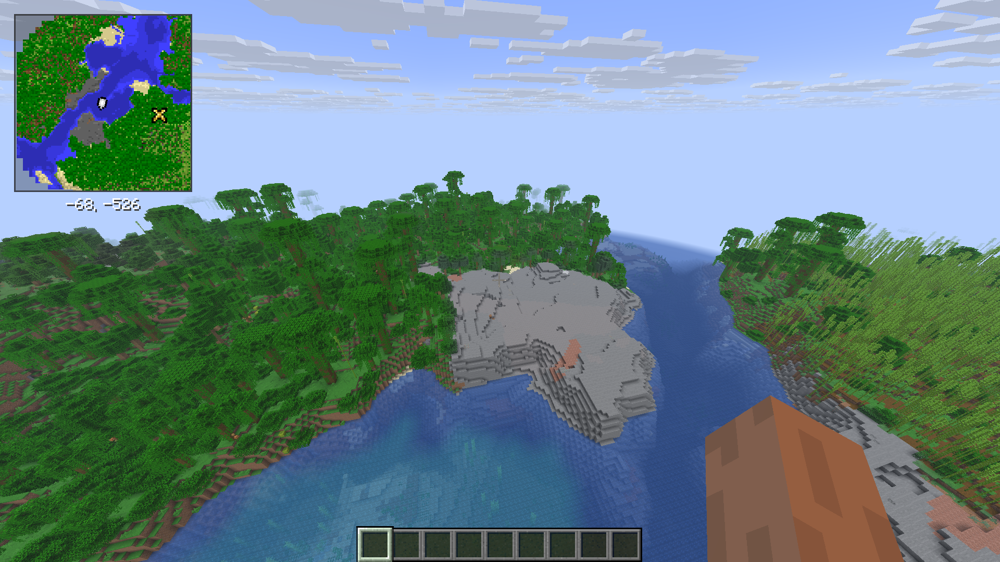

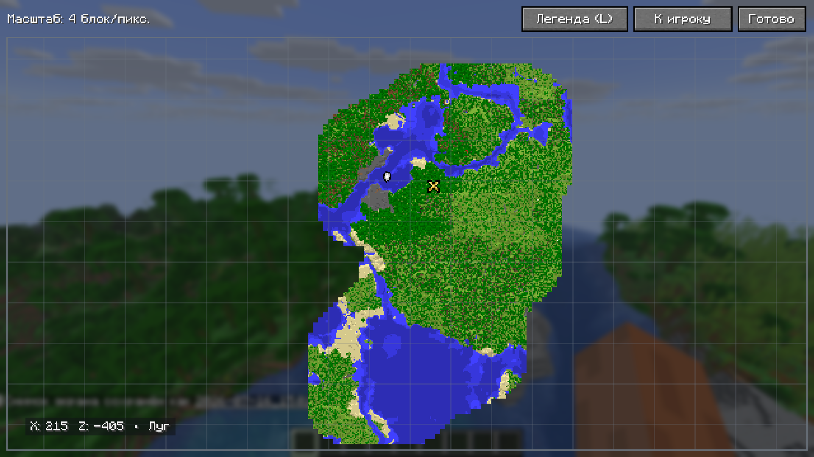

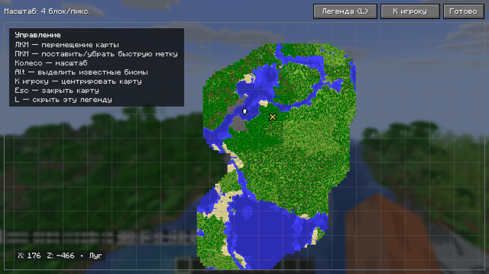

### Полноэкранная карта

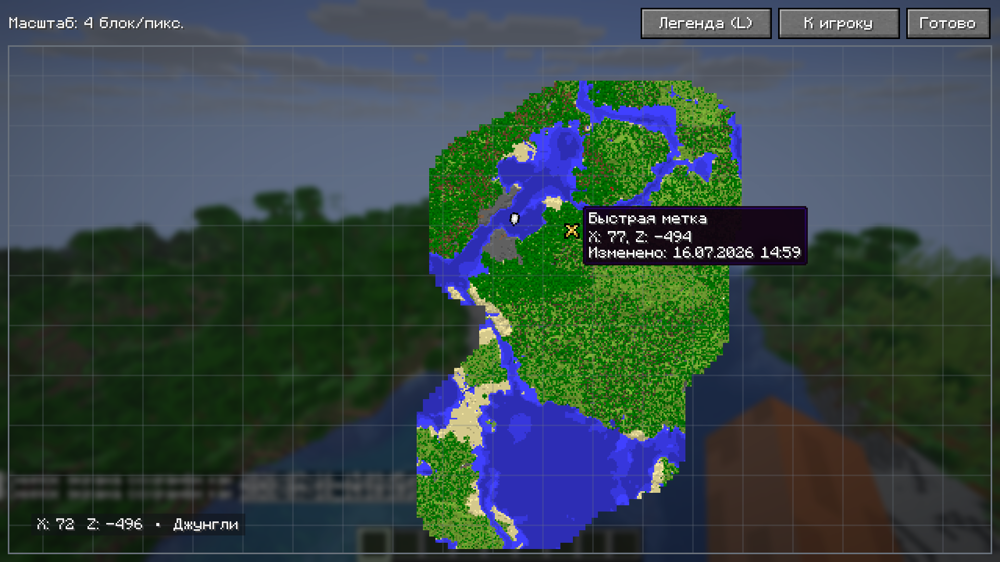

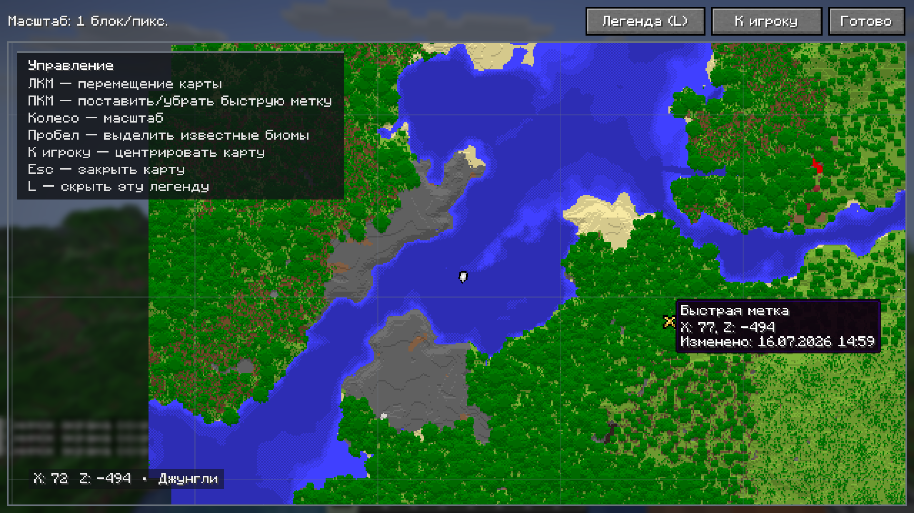

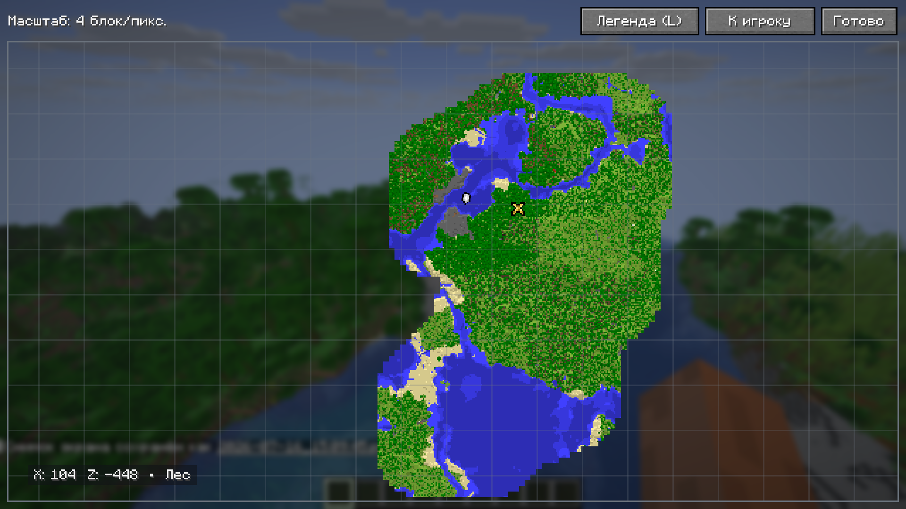

### Биомы и туман местности

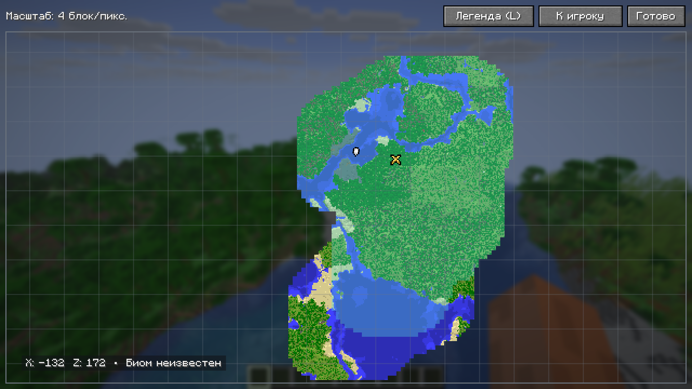

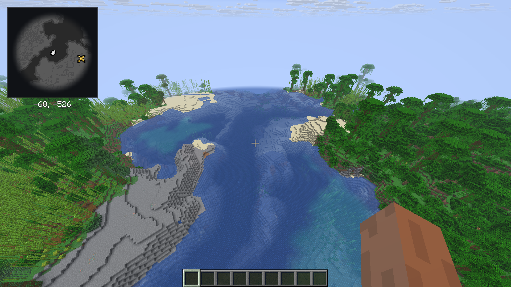

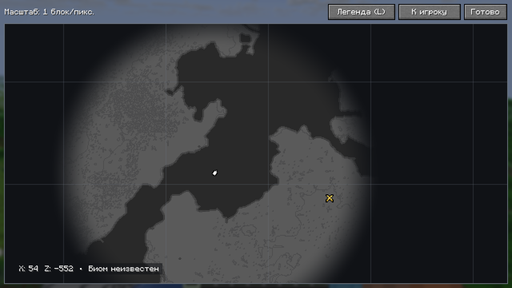

### Настройки

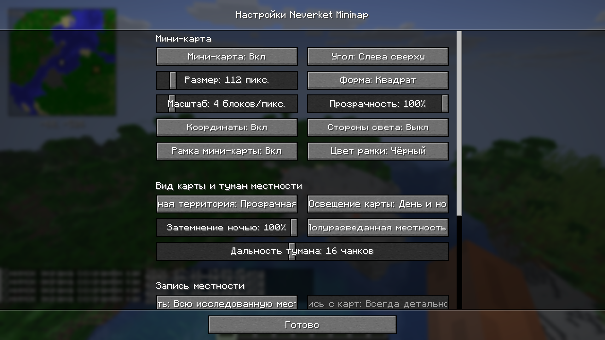

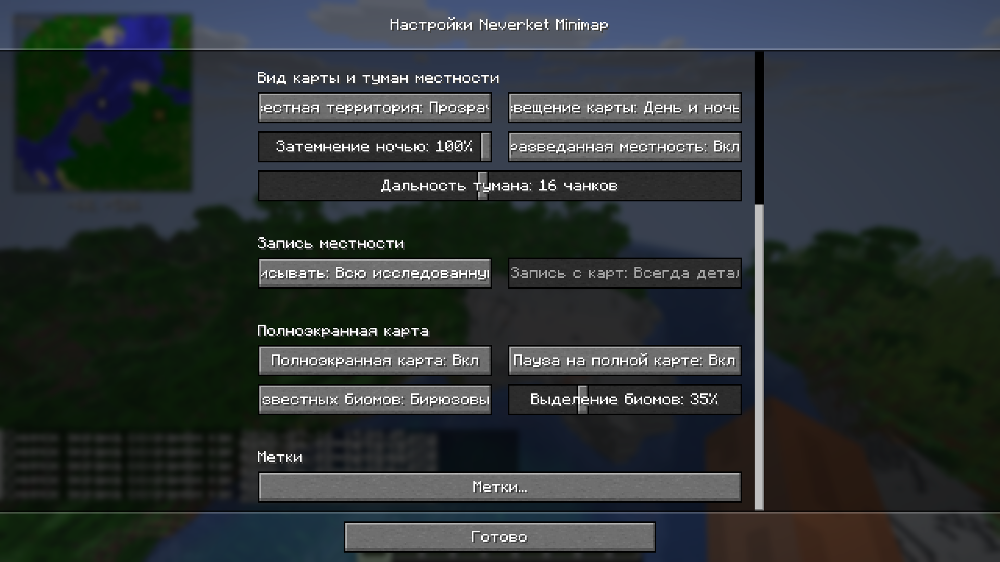

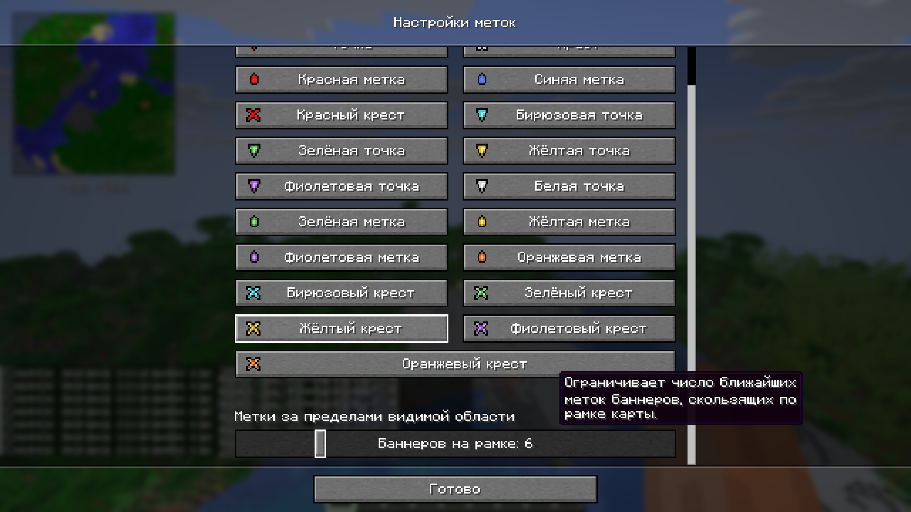

### Ванильные карты и баннеры

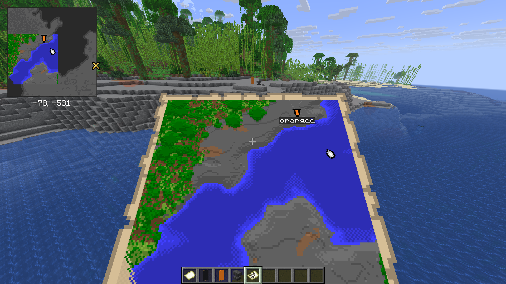

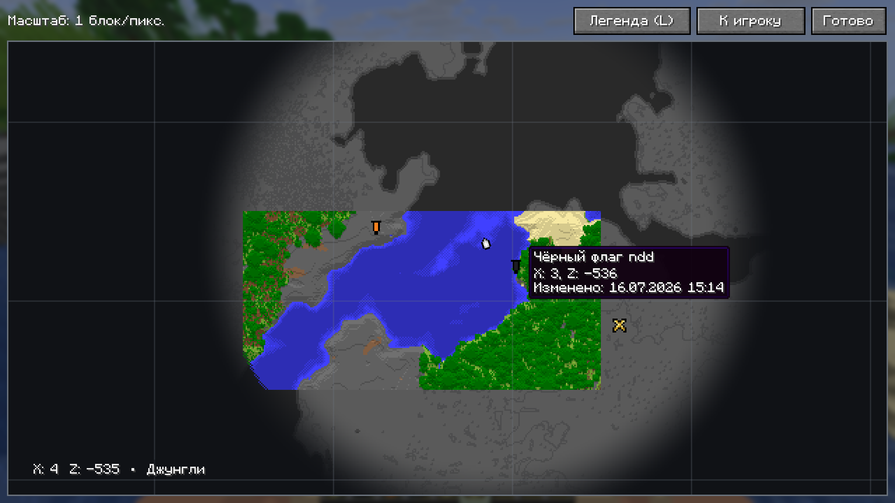

## Возможности

### Мини-карта

- Квадратная или круглая форма.
- Размер от 96 до 256 пикселей.
- Масштаб от 1 до 32 блоков на пиксель.
- Прозрачность от 25 до 100%.
- Четыре угла экрана; по умолчанию используется левый верхний.
- Координаты и стороны света можно скрыть отдельно.
- Рамку можно отключить или выбрать для неё один из восьми цветов.
- Тёмная или полупрозрачная неизвестная территория.
- Постоянная яркость либо затемнение карты ночью с настраиваемой силой.
- Мини-карта скрывается при открытии полноэкранной карты.
- В правом верхнем углу карта учитывает первый ряд эффектов. Следующие ряды могут располагаться поверх неё. Снизу учитываются субтитры.

Игрок отмечен компактной стрелкой в стиле ванильной карты. Цвета детальной местности используют ванильные `MapColor`, включая тени рельефа и изменение оттенка воды по глубине.

### Режимы записи

Доступны два режима.

`Сделанные карты` — сохраняются пиксели ванильных карт, которые клиент получил, пока карта находилась в инвентаре игрока.

`Вся исследованная местность` — сохраняются цвета поверхности чанков, которые уже загрузил `ClientWorld`. Дополнительные чанки мод не запрашивает.

Для режима `Сделанные карты` есть два варианта детализации.

`Пиксельно, как в оригинале` сохраняет исходный масштаб карты.

`Всегда детально` уточняет известную территорию по загруженным чанкам. Детальный слой остаётся ограничен реально открытыми пикселями ванильной карты.

Карты разных масштабов совмещаются в мировых координатах. В пересечениях используется наиболее подробный известный пиксель. Верхний мир, Незер и Энд хранятся раздельно.

### Полуразведанная местность

Опция показывает вокруг игрока упрощённый чёрно-белый контур загруженной поверхности. Вода и суша имеют разные оттенки, а внешний край плавно исчезает.

Эти данные:

- хранятся только в оперативной памяти;
- не содержат подробных цветов блоков и биомов;
- ограничены кругом вокруг игрока;
- очищаются при смене мира или измерения.

Фактический радиус равен минимуму из настройки тумана, дальности прорисовки клиента и 32 чанков. Значение по умолчанию — 8 чанков.

### Полноэкранная карта

- Перемещение удержанием ЛКМ.
- Масштабирование колесом мыши.
- Центрирование на игроке при открытии.
- Кнопка `К игроку`.
- Сетка с шагом 128 блоков — размер маленькой ванильной карты масштаба 1:1.
- Координаты, масштаб и доступный биом под курсором.
- `Биом неизвестен`, если данные не записаны или территория скрыта выбранным режимом записи.
- Скрываемая легенда управления.
- Полноэкранное затемнение и размытие фона.
- Настраиваемая пауза в одиночной игре. На сервере экран игру не останавливает.

При удержании клавиши подсветки выделяется только цветная территория, для которой записан биом. Цвет и прозрачность выделения задаются в настройках. Отдельная опция показывает круг текущей области записи вокруг игрока.

### Метки

В каждом атласе может быть только одна быстрая метка. У неё нет названия и окна редактирования: повторное действие переносит или удаляет её.

Быструю метку можно поставить:

- сочетанием `Ctrl+M` в игре;
- ПКМ по полноэкранной карте.

ПКМ по существующей метке удаляет её. Для иконки используются формы из ванильного атласа карт и их цветовые варианты; размер и геометрия исходного спрайта не меняются.

Мод также показывает метки ванильных баннеров. При наведении доступны название, координаты и время последнего наблюдения. Баннеры нельзя редактировать через мод.

Быстрая метка и ближайшие баннеры за пределами карты скользят по рамке. Лимит баннеров на рамке настраивается от 0 до 32; быстрая метка в этот лимит не входит.

## Управление

`H` — показать или скрыть мини-карту.

`=` — перейти к следующему масштабу мини-карты.

`M` — открыть или закрыть полноэкранную карту.

`N` — открыть или закрыть настройки мода.

`Пробел` — удерживать для подсветки записанных биомов.

`Ctrl` — удерживать для отладки обновления чанков.

`Ctrl+M` — поставить или удалить быструю метку у игрока.

`L` — показать или скрыть легенду на полноэкранной карте.

Действия `H`, `=`, `M`, `N`, подсветка биомов и отладка регистрируются в стандартном меню `Настройки → Управление → Назначение клавиш → Neverket Minimap` и могут быть переназначены. `Ctrl+M` и `L` сейчас являются фиксированными сочетаниями.

На полноэкранной карте отладку также можно вызвать удержанием кнопки `Отладка (<клавиша>)` в верхней панели.

## Настройки

Экран настроек использует стандартные кнопки, ползунки, подсказки при наведении, затемнение и размытие фона. Параметры разделены на группы.

### Мини-карта

- показ мини-карты;
- угол экрана;
- размер;
- квадратная или круглая форма;
- масштаб;
- прозрачность;
- координаты;
- стороны света;
- показ и цвет рамки.

### Вид карты и туман местности

- вид неизвестной территории;
- постоянное или зависящее от времени суток освещение;
- сила ночного затемнения от 0 до 100% с шагом 5%;
- показ полуразведанной местности;
- дальность тумана от 2 до 32 чанков.

### Запись местности

- сделанные карты или вся исследованная местность;
- исходные пиксели карты или постоянная детализация по загруженным чанкам.

### Полноэкранная карта

- возможность открыть карту;
- пауза в одиночной игре;
- показ биома под курсором;
- цвет подсветки известных биомов;
- прозрачность подсветки от 5 до 100% с шагом 5%;
- рамка текущей области записи.

### Метки

- визуальный выбор иконки быстрой метки;
- от 0 до 32 ближайших баннеров на рамке.

Зависимые параметры блокируются, когда они не применимы. Например, ночное затемнение доступно только в режиме `День и ночь`, а детализация карт — только при записи сделанных карт.

## Обновление чанков и производительность

Сканирование выполняется только на клиенте и только для уже загруженных чанков. За один клиентский тик успешно обрабатывается не более одного чанка.

Приоритеты планировщика:

1. Новый текущий чанк.
2. Повторная проверка чанка игрока примерно четыре раза в секунду.
3. Повторная проверка восьми соседних чанков по кругу; каждый из них обычно проверяется раз в 1–2 секунды.
4. Первичная запись ещё неизвестных загруженных чанков от центра к краю.
5. Редкая повторная проверка дальних чанков.

При переходе игрока в новый чанк первичный и дальний обходы сразу переносятся к новой позиции. Центр и восемь соседних чанков тумана дополнительно прогреваются небольшими порциями по два чанка за тик.

Для остальной территории тумана работает отдельный быстрый проход: до четырёх новых загруженных чанков за тик. Он ограничен бюджетом в 2 мс, поэтому на медленном компьютере завершится раньше заданного максимума. Пропущенные или ещё не загруженные чанки проверяются повторно после короткой паузы.

Цветная исследованная территория записывается пакетно: до восьми новых чанков за тик при бюджете 3 мс. Известные чанки пропускаются до 512 проверок за тик, поэтому после быстрого перемещения очередь почти сразу доходит до новой внешней границы. Ограничение по времени важнее лимита количества: если обработка чанка дорогая, пакет автоматически будет меньше.

Туман читает небольшой кэш поверхностей, а не обращается к `ClientWorld` для каждого пикселя текстуры. Неизменившийся чанк не увеличивает версию кэша и не вызывает перестроение карты. Обновление одной ванильной карты меняет только её часть пространственного индекса.

Мини-карта принимает новые данные не чаще одного раза в 100 мс. Для более дорогой полноэкранной текстуры интервал составляет 350 мс.

### Отладка

На полноэкранной карте удерживайте назначенную клавишу отладки, по умолчанию `Ctrl`, либо верхнюю кнопку отладки. Последние 16 обработанных чанков будут закрашены: новый ярче, старые постепенно прозрачнее.

Панель имеет фиксированный размер и располагается слева сверху на карте. Пока открыта отладка, легенда в этой области временно скрывается и возвращается после отпускания клавиши или кнопки.

Панель показывает отдельными строками:

- радиус записи;
- фактический радиус тумана;
- текущее кольцо дальнего обхода;
- координаты последнего обработанного чанка;
- время последнего сканирования;
- среднее и максимальное время по текущей истории;
- время последнего перестроения текстуры карты.

При перетаскивании карты ЛКМ новые данные продолжают появляться с обычным ограничением частоты обновления текстуры. Отпускать кнопку для завершения отрисовки не требуется.

Если игра фризит, сравните время сканирования и текстуры до и во время скачка кадра. Для воспроизводимого сравнения используйте один мир, одинаковую позицию, дальность прорисовки и масштаб карты.

## Файлы и сохранение

После первого запуска создаётся каталог:

```text
.minecraft/config/neverket-minimap/
├── config.json
└── worlds/
    └── <идентификатор мира>.json.gz
```

В одиночном мире дополнительно создаётся:

```text
<папка мира>/data/neverket-minimap-world-id.txt
```

UUID из этого файла отличает пересозданный мир от удалённого мира с тем же названием папки. Для сервера ключ атласа включает нормализованный адрес сервера. Имя файла в `worlds` получается из SHA-256 ключа и не содержит адрес или путь в открытом виде.

В атласе сохраняются:

- снимки ванильных карт;
- детальные тайлы поверхности, если они нужны выбранному режиму;
- ссылки на записанные чанки;
- биомы с шагом 4×4 блока;
- быстрая метка;
- метки баннеров.

Формат — GZIP-сжатый JSON. Цвета хранятся однобайтовыми массивами и кодируются Base64, идентификаторы биомов переиспользуются в памяти. Формат удобен для совместимости и диагностики, но не является минимально возможным двоичным представлением.

Сохранение запускается после пяти секунд без новых данных либо не реже одного раза в две минуты при непрерывном исследовании. Подготовленный снимок сжимается и записывается в отдельном потоке. Сначала создаётся временный файл, затем он атомарно заменяет основной. Изменение быстрой метки сразу ставит сохранение в очередь.

Чтобы сбросить настройки, удалите `config.json`. Чтобы удалить карты, закройте игру, сделайте резервную копию и удалите нужный файл из `worlds` либо весь каталог `worlds`.

Старый каталог `config/cartographer-minimap` мигрирует в `config/neverket-minimap`. Если существуют оба каталога, копируются только отсутствующие файлы; актуальные данные не перезаписываются.

## Требования

- Minecraft Java Edition 26.2.
- Fabric Loader 0.19.3 или новее для Minecraft 26.2.
- Fabric API 0.154.2+26.2 или совместимая версия.
- Java 25 для игры и сборки этой версии проекта.

## Установка

1. Установите Fabric Loader для Minecraft 26.2.
2. Положите Fabric API в каталог `mods`.
3. Положите туда `neverket-minimap-<версия>.jar` без суффикса `-sources`.
4. Запустите клиент с профилем Fabric.

Стандартные каталоги `mods`:

- Windows: `%APPDATA%\.minecraft\mods`;
- Linux: `~/.minecraft/mods`;
- macOS: `~/Library/Application Support/minecraft/mods`.

## Сборка

Команды нужно выполнять из корня репозитория `neverket-minimap`.

Проверка Java:

```powershell
java -version
Test-Path .\gradlew.bat
.\gradlew.bat --version
```

В выводе Gradle `Launcher JVM` должна быть указана Java 25.

Сборка в Windows:

```powershell
.\gradlew.bat clean build
```

Если системная Java отличается:

```powershell
$env:JAVA_HOME = "C:\Program Files\Java\jdk-25"
$env:Path = "$env:JAVA_HOME\bin;$env:Path"
.\gradlew.bat clean build
```

Linux и macOS:

```bash
./gradlew clean build
```

Результат:

```text
build/libs/neverket-minimap-<версия>.jar
```

JAR с суффиксом `-sources` предназначен для разработчиков и в игру не устанавливается.

## Версия сборки

Файл `version.properties` содержит:

- `version_major` — первая цифра;
- `version_minor` — вторая цифра;
- `build_number` — третья цифра;
- `last_version_*` и `last_build_hash` — служебное состояние.

`build_number` увеличивается только при изменении исходников, ресурсов или конфигурации сборки. Повторный `build` без изменений сохраняет номер. При изменении `version_minor` третья цифра сбрасывается в `0`; при изменении `version_major` в `0` сбрасываются вторая и третья цифры.

Редактировать вручную нужно только `version_major` и `version_minor`.

## Запуск из исходников

```powershell
.\gradlew.bat runClient
```

Тестовая директория игры создаётся в `run/`.

В IntelliJ IDEA откройте репозиторий как Gradle-проект, выберите JDK 25 и запустите задачу `runClient` или конфигурацию `Minecraft Client`.

## Проверки

```powershell
.\gradlew.bat test
.\gradlew.bat build
```

Автоматические тесты проверяют:

- мировые координаты и пиксели карт;
- карты разных масштабов и измерений;
- объединение частично обновлённых карт;
- пространственный индекс и покрытие чанков;
- детальные тайлы поверхности;
- биомы;
- быструю метку и баннеры;
- круговую область записи;
- сохранение, загрузку и совместимость форматов;
- идентификацию одиночных миров.

Перед выпуском также проверяются компиляция клиентского source set, JSON локализаций, версия внутри `fabric.mod.json` и содержимое итогового JAR.

## Ограничения

Мод может использовать только данные, уже доступные ванильному клиенту.

На сервере данные предмета-карты не всегда содержат координаты её центра. Далёкая карта корректно привязывается к миру после появления на ней обычной метки игрока. В одиночной игре точный центр доступен через встроенный сервер.

Карта из рамки, шалкера или другого контейнера не импортируется, пока клиент не получит её данные через предмет в инвентаре игрока.

Биом записывается только при загрузке соответствующего чанка. Если территория цветная, но никогда не загружалась этим клиентом, под курсором будет указано `Биом неизвестен`.

## Лицензия

MIT — см. [LICENSE](LICENSE).
